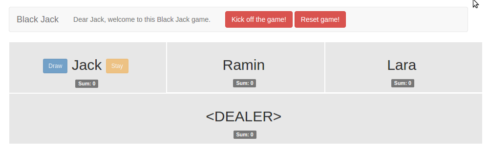
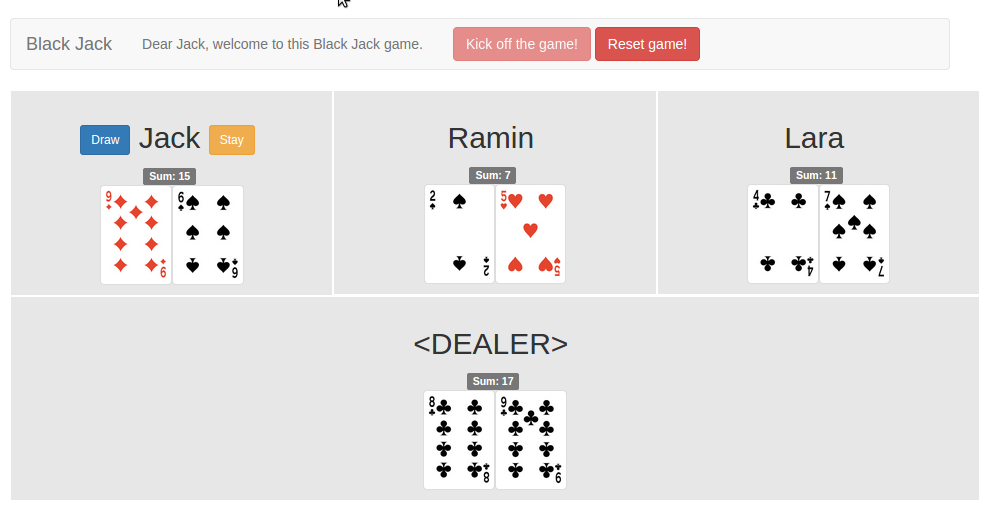
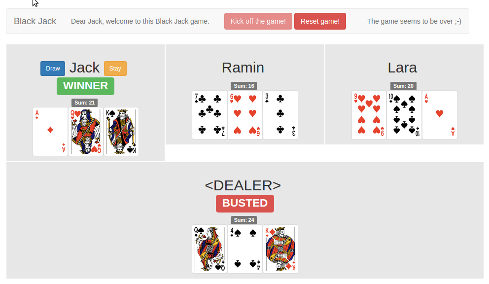

# black_jack_sinatra
Sinatra integration of Black Jack

## start the game

Your name is Jack. You have two buttons: "draw" and "stay". At the beginning they are disabled because the dealer has to give two cards.

## kick off

To achieve this press "Kick off the game" button.

## result

Now you can press either "draw" or "stay". The other players are forced to "draw". If you win the badge "WINNER" appears next to your name.

